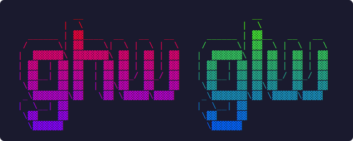

<p align="center">
  
</p>

# CI Watcher

Terminal UI for monitoring CI/CD pipelines. Supports **GitHub Actions** (`ghw`) and **GitLab CI** (`glw`).


## Features

- Live-updating pipeline/workflow list with adaptive polling (3s/10s/30s)
- Expandable tree view: runs > jobs > steps (GitHub) or pipelines > jobs (GitLab)
- Failure log viewer with scrolling and clipboard copy
- Cancel, delete, and retry pipelines directly from the TUI
- Open any run/pipeline in the browser
- Desktop notifications on status changes
- Filter by All / Active / Current branch
- Quick-select runs 1-9
- Detail overlay with full run/pipeline metadata

## Prerequisites

| Tool | Purpose | Install |
|------|---------|---------|
| [gh](https://cli.github.com/) | GitHub CLI (for `ghw`) | `brew install gh` or [cli.github.com](https://cli.github.com/) |
| [glab](https://gitlab.com/gitlab-org/cli) | GitLab CLI (for `glw`) | `brew install glab` or [gitlab.com/gitlab-org/cli](https://gitlab.com/gitlab-org/cli) |

Authenticate before first use:

```bash
gh auth login    # for ghw
glab auth login  # for glw
```

## Install

### Quick install (Linux x86_64)

```bash
curl -sSL https://raw.githubusercontent.com/INS-JVidal/watch-gh-actions/master/install.sh | sh
```

Install only one binary:

```bash
curl -sSL https://raw.githubusercontent.com/INS-JVidal/watch-gh-actions/master/install.sh | sh -s -- ghw
curl -sSL https://raw.githubusercontent.com/INS-JVidal/watch-gh-actions/master/install.sh | sh -s -- glw
```

On other platforms (macOS, aarch64, etc.) the script automatically builds from source using `cargo`.

### From source

```bash
git clone https://github.com/YOUR_USER/watch-gh-actions.git
cd watch-gh-actions
make install       # installs both ghw and glw to ~/.local/bin
```

Install only one binary:

```bash
make install-ghw   # GitHub Actions watcher only
make install-glw   # GitLab CI watcher only
```

### Uninstall

```bash
make uninstall
```

## Usage

### GitHub Actions (`ghw`)

```bash
ghw                          # auto-detect repo and branch from cwd
ghw --repo owner/repo        # explicit repository
ghw --workflow ci.yml         # filter to a specific workflow
ghw --branch main            # filter to a branch
ghw --limit 30 --interval 5  # 30 runs, poll every 5s
```

### GitLab CI (`glw`)

```bash
glw                                  # auto-detect project and branch from cwd
glw --project group/project          # explicit project
glw --project group/subgroup/project # nested groups supported
glw --source push                    # filter by pipeline source
glw --branch main                    # filter to a branch
glw --limit 30 --interval 5         # 30 pipelines, poll every 5s
```

### Common flags

| Flag | Description | Default |
|------|-------------|---------|
| `-b, --branch` | Filter to a specific branch | auto-detected |
| `-i, --interval` | Poll interval in seconds | 10 |
| `-l, --limit` | Max runs/pipelines to display | 20 |
| `--no-notify` | Disable desktop notifications | |
| `--verbose` | Debug logging to `$XDG_STATE_HOME/{ghw,glw}/debug.log` | |

## Keybindings

### Navigation

| Key | Action |
|-----|--------|
| `j` / `Down` | Move down |
| `k` / `Up` | Move up |
| `l` / `Right` / `Enter` | Expand (run > jobs > steps) |
| `h` / `Left` | Collapse |
| `Space` | Toggle expand/collapse |
| `1`-`9` | Quick-select run by position |

### Actions

| Key | Action |
|-----|--------|
| `r` | Refresh |
| `R` | Rerun failed jobs |
| `c` | Cancel run/pipeline |
| `x` | Delete run/pipeline |
| `o` | Open in browser |
| `e` | View failure logs |
| `d` | Show detail overlay |
| `f` | Cycle filter (All / Active / Branch) |
| `b` | Filter current branch |
| `q` / `Esc` | Quit (or close overlay) |
| `Ctrl+C` | Force quit |

### Log viewer

| Key | Action |
|-----|--------|
| `j` / `Down` | Scroll down |
| `k` / `Up` | Scroll up |
| `PageDown` / `PageUp` | Page scroll |
| `g` / `G` | Jump to top / bottom |
| `y` | Copy logs to clipboard |
| `q` / `e` / `Esc` | Close |

## Architecture

The project is a Cargo workspace with three crates:

```
crates/
  ciw-core/    Shared library: TUI, state management, polling, input handling
  ghw/         GitHub Actions binary (uses gh CLI)
  glw/         GitLab CI binary (uses glab CLI)
```

`ciw-core` defines the `CiExecutor` and `CiParser` traits. Each binary provides its own implementation (`GhExecutor`/`GhParser` and `GlabExecutor`/`GlabParser`), while sharing ~80% of the codebase through the core library.

## Development

```bash
cargo test --workspace          # run all tests
cargo clippy --workspace        # lint
cargo fmt --all --check         # check formatting
cargo build --release           # build both binaries
```

## License

MIT
