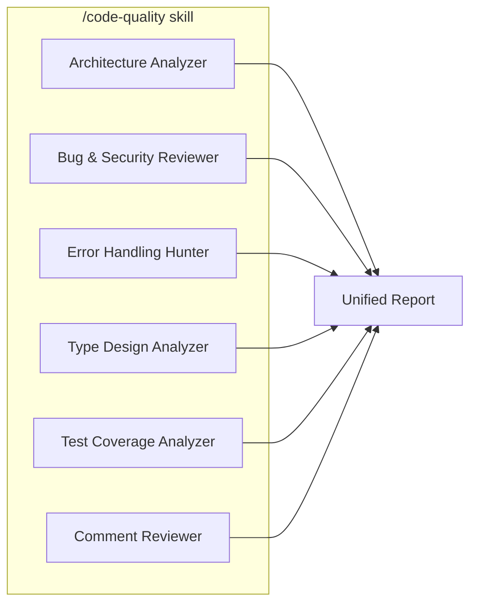
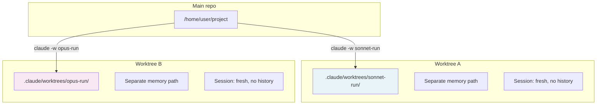
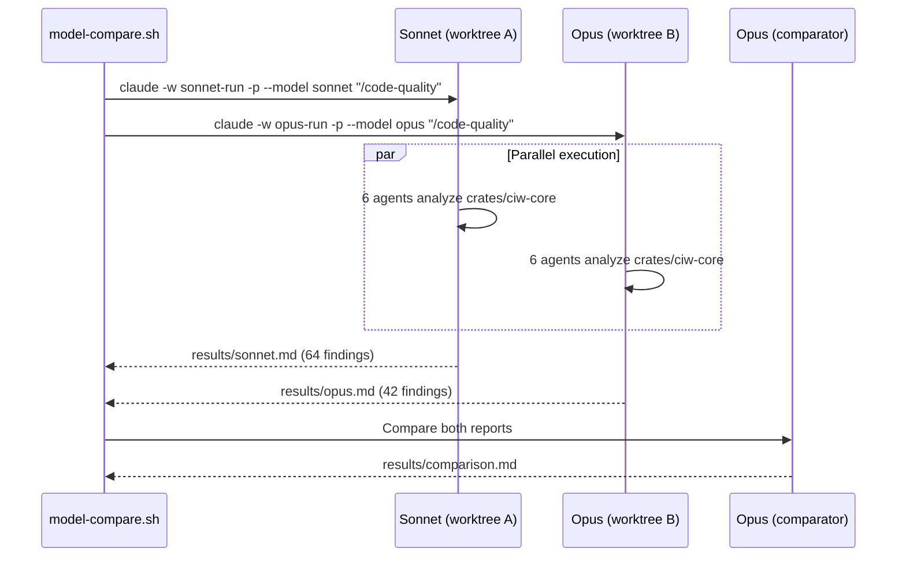
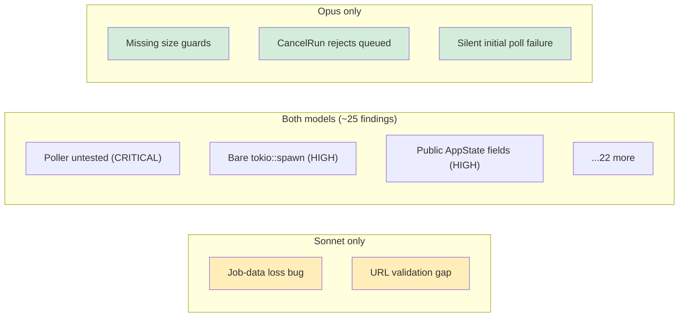
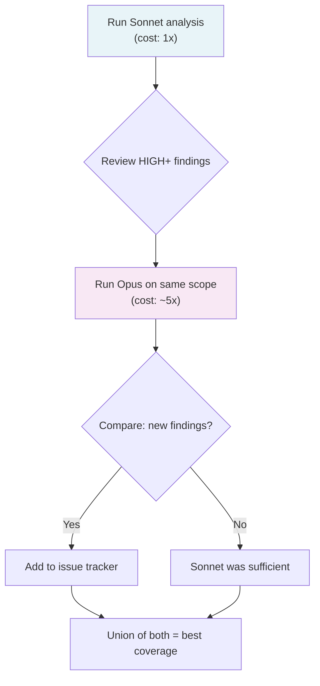

# I Made Two AI Models Review the Same Codebase. Neither Won.

There's a question that keeps coming up in every team using AI for code review: **is the expensive model worth it?** Opus costs roughly 5x what Sonnet does. For code generation, you can feel the difference. But for code *analysis* — finding bugs, spotting architectural debt, flagging security gaps — does paying more actually surface better findings?

I decided to find out empirically.

## The setup

The subject is [CI Watcher](https://github.com/opos/watch-gh-actions), a Rust terminal UI for monitoring GitHub Actions and GitLab CI pipelines. ~5,000 lines of async Rust across three crates, with a shared library (`ciw-core`) that handles the event loop, TUI rendering, polling, and change detection.

The analysis tool is a custom Claude Code skill called `/code-quality` — it spawns **six specialized agents** in parallel, each focused on a different dimension:



Each agent reads the same source files independently, then an orchestrator deduplicates and merges the findings into a single prioritized report. Think of it as a code review panel where six specialists examine the code, then a senior engineer reconciles their notes.

## The isolation problem

The critical requirement was **zero interference**. If Sonnet runs first and the session writes a memory file, Opus reads it. If they share a conversation context, the orchestrator's pattern-matching on run 1 leaks into orchestration of run 2. Even a shared working directory means one process could write a temp file the other picks up.

I needed two completely independent analysis sessions running the same prompt against the same code, with no shared state whatsoever.

### Why git worktrees?

Claude Code has a `-w` flag that creates a [git worktree](https://git-scm.com/docs/git-worktree) — an isolated copy of the repository with its own working directory and its own auto-memory path. Combined with `--no-session-persistence` (no session history saved) and `-p` (non-interactive, print-and-exit), each invocation becomes a hermetically sealed analysis:



Each worktree resolves to a different absolute path, so Claude Code's auto-memory (which is scoped by project path) gives each model a completely separate memory namespace. No shared conversation, no shared memory, no shared working directory.

I considered two alternatives and rejected both:

- **Same session with `/clear` between runs** — `/clear` resets conversation history but auto-memory persists. If run 1 writes a pattern to memory, run 2 sees it. Fails the isolation requirement.
- **Two `claude -p` invocations without worktrees** — Better, but both share the same working directory and memory path. Running in parallel mitigates the memory risk, but it's a theoretical leak. Worktrees eliminate it entirely.

## The experiment script

The whole experiment is a 40-line bash script. Here's the essential logic:

```bash
#!/usr/bin/env bash
set -euo pipefail

SCOPE="${1:-crates/ciw-core}"
MODELS=("sonnet" "opus")
RESULTS_DIR="results/$(date +%Y%m%d-%H%M%S)"
mkdir -p "$RESULTS_DIR"

# Workaround: Claude Code prevents nested sessions
# via CLAUDECODE env var — unset it for subprocesses
unset CLAUDECODE

# Phase 1: Run both models in parallel, fully isolated
for model in "${MODELS[@]}"; do
  claude -w "${model}-run" -p \
    --model "$model" \
    --dangerously-skip-permissions \
    --no-session-persistence \
    "/code-quality $SCOPE" \
    > "$RESULTS_DIR/${model}.md" &
done
wait

# Phase 2: A third session compares the two reports
claude -p --model opus \
  --dangerously-skip-permissions \
  --no-session-persistence \
  "Compare these reports: $RESULTS_DIR/sonnet.md
   and $RESULTS_DIR/opus.md ..." \
  > "$RESULTS_DIR/comparison.md"
```

The workflow looks like this:



Phase 1 runs both models simultaneously. Phase 2 feeds both reports to a third Opus session that acts as a judge — comparing findings, checking for false positives, and evaluating which model was right on severity disagreements.

## The numbers

Both models completed their analysis. Here's what came back:

| Metric | Sonnet | Opus |
|--------|--------|------|
| Total findings | 64 | 42 |
| Critical | 2 | 2 |
| High | 14 | 10 |
| Medium | 24 | 16 |
| Low | 24 | 14 |
| False positive rate | ~14% | ~4% |

The raw totals are misleading. Sonnet's higher count is largely driven by more LOW-severity findings — redundant comment flags, test gaps for trivial code paths, performance concerns that the model itself calls "benign at current scale." Opus applies heavier deduplication and a higher bar for inclusion.

The real comparison is in the HIGH+ tier.

## Where they agree

Both models independently converged on **~25 findings** at the same file and line number. This is the most interesting result: two completely independent analyses, with different weights and internal reasoning, arriving at the same structural problems.

Selected overlapping findings (all at identical severity):

| Finding | Location | Severity |
|---------|----------|----------|
| Poller has zero test coverage | `poller.rs:52` | CRITICAL |
| Startup screen zero test coverage | `startup.rs:170` | CRITICAL |
| Poller uses bare `tokio::spawn` (violates project rules) | `ghw/main.rs:215` | HIGH |
| Two parallel enums encode the same overlay concept | `app.rs:262` | HIGH |
| All `AppState` fields public — no invariant enforcement | `app.rs:278` | HIGH |
| `truncate()` off-by-one on ellipsis | `app.rs:49` | MEDIUM |

When two independent reviewers flag the same line with the same severity, that's a strong validation signal. These findings are real.

## Where they diverge

This is where it gets interesting. Each model found real, HIGH-severity bugs that the other missed entirely.

### Bugs only Opus found

**Missing size guards before JSON parsing** (`poller.rs:102`) — The project's own error-handling rules mandate calling `check_response_size()` before any `serde_json::from_str()`. This prevents an adversarial API response from OOMing the process. Opus flagged it; Sonnet didn't notice.

**`CancelRun` incorrectly rejects queued runs** (`ghw/main.rs`) — The cancel handler only allows cancellation of `InProgress` runs, but GitHub's API accepts cancellation of queued runs too. Users see a wrong "Cannot cancel" error. A functional bug that maps directly to a support ticket.

**Silent initial poll failure** (`poller.rs:56`) — First-poll failure gives no user feedback. Subsequent failures show a toast via the retry path, but the first failure is swallowed.

### Bugs only Sonnet found

**Poll updates silently discard fetched job data** (`app.rs:698`) — This was the single most impactful finding across both reports. Because `jobs` is `#[serde(skip)]`, parsed runs always arrive with `jobs: None`. The `update_runs` method does a full replace, silently wiping previously-fetched job lists. Expanded runs flicker and re-fetch on every poll cycle. A real, user-visible bug.

**URL from API passed to browser without validation** (`app.rs:609`) — The project's security rules require HTTP scheme validation before opening URLs. The core library returns `run.url` verbatim from deserialized API JSON, placing the trust burden on each binary crate.

### The pattern

Sonnet's unique finds lean toward **data-flow correctness** — it traces how values propagate through the system and catches cases where state is silently corrupted or lost.

Opus's unique finds lean toward **API-contract correctness** — it checks whether code behavior matches what external systems actually accept, and whether internal rules (like the size-guard mandate) are consistently applied.

Neither blind spot is "better." They're orthogonal.

## Severity calibration

In 9 cases where both models flagged the same issue but disagreed on severity, the comparison judge (a third Opus session) sided with Opus 8 out of 9 times.

| Finding | Sonnet | Opus | Correct |
|---------|--------|------|---------|
| Branch error silently discarded | MEDIUM | HIGH | Opus |
| Terminal error `let _ =` dropped | MEDIUM | HIGH | Opus |
| `run_app` ~1100 lines duplicated | MEDIUM | HIGH | Opus |
| Missing comment on `NOTIFICATION_TTL` | HIGH | MEDIUM | Opus |
| Missing comment on `QUICK_SELECT_MAX` | HIGH | MEDIUM | Opus |
| `SPINNER_FRAME_COUNT` fragile coupling | LOW | HIGH | Opus |

The pattern: Sonnet inflates comment and documentation findings to HIGH while underrating error-handling and architecture issues. Opus rates comment nits as MEDIUM or LOW and reserves HIGH for things that affect runtime behavior.

## Is Opus worth 5x the cost?

**For a single run: no.** Both models catch the same CRITICAL issues and ~80% of the same HIGH issues. Opus has better precision and calibration, but the coverage overlap is substantial. If you're budget-constrained, Sonnet gives you most of the value.

**For the dual-run workflow: yes, but not for the reason you'd expect.** The value isn't that Opus is 5x better. It's that each model catches 2-3 real HIGH bugs the other misses. The **union** of both reports is meaningfully stronger than either alone:



The combined cost is ~6x Sonnet alone. The combined coverage catches 5 additional HIGH bugs that any single model misses. For a codebase where thoroughness matters — say, before a major release — that's a good trade.

## The practical takeaway

The most useful finding isn't about which model is "better." It's that **LLMs have genuinely different analytical blind spots**, and these blind spots are consistent enough to be exploitable.

Here's the workflow I'd recommend:



1. **Sonnet first** — broad, cheap, catches most issues
2. **Opus second** — focused on the HIGH+ tier where its precision and unique catches justify the premium
3. **Compare and union** — the disagreements between models are where the most interesting bugs hide

The total cost is ~6x a single Sonnet run. The total coverage is substantially better than either model alone. And the disagreements themselves are a signal — if two independent reviewers rate the same issue differently, that disagreement is worth investigating regardless of who's right.

---

## Reproducing this experiment

The full experiment runs with a single command:

```bash
bash scripts/model-compare.sh                  # defaults to crates/ciw-core
bash scripts/model-compare.sh crates/ghw       # or pick a different scope
```

Requirements:
- [Claude Code](https://claude.com/claude-code) CLI installed
- A codebase with a `/code-quality` skill (or substitute your own analysis prompt)
- Two models available on your Anthropic plan

The script creates a timestamped `results/` directory with three files: `sonnet.md`, `opus.md`, and `comparison.md`. The entire run takes about 5-10 minutes depending on codebase size.

The key implementation detail: `unset CLAUDECODE` before spawning subprocesses. Claude Code sets this environment variable to prevent accidental nested sessions. Since we're intentionally launching independent processes, unsetting it is the correct workaround.

## Summary scoreboard

| Dimension | Winner | Margin |
|-----------|--------|--------|
| Overlap coverage | Tie | Both catch ~25 core issues |
| Unique HIGH+ finds | **Opus** (3 vs 2) | Slight |
| Severity calibration | **Opus** (8/9 correct) | Clear |
| Depth and actionability | Tie | Different strengths |
| False positive rate | **Opus** (~4% vs ~14%) | Clear |
| Cost efficiency | **Sonnet** | Clear |
| Best single unique find | **Sonnet** (job-data loss) | Slight |

Neither model is strictly dominant. The interesting result is that the *combination* is strictly better than either alone — and the cost of running both is low enough to be practical.

The models have different eyes. Use both.
